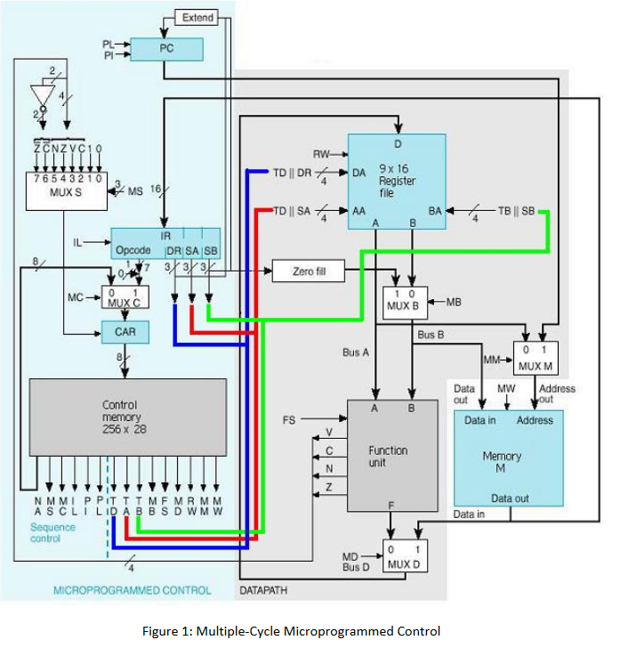

# vhdl-processor



Microcoded instruction set processor in VHDL

## Getting started
  ### Prerequisites
  You will need to have installed:
  1. [Vivado Design Suite](https://www.xilinx.com/support/download.html)
  2. Python (optional)

  ### Running the simulation
  1. Clone the repo
     ```
     git clone https://github.com/lexesjan/vhdl-processor.git
     ```
  2. Open Vivado and click ```Open Project```
  3. Open the ```vhdl-processor.xpr``` file
  4. Modify the program in the memory (optional)
      1. Go to the ```assembler``` directory
      ```
      cd assembler
      ```
      1. Edit the ```in.txt``` file
      2. Run the following command
      ```
      python assemble.py < in.txt | python formatter.py
      ```
      3. Copy the output of the into the ```memory_512x16bits.vhd``` file
  5. Run the simulation
      1. Click ```Run Simulation``` then
      2. Click ```Run Behavioral Simulation```
    
  ### Documentation
  [Discussion of the simulation results](Lexes-Jan-Mantiquilla-Processor.pdf)
  
  #### Instructions implemented
  | Mnemonic | Instruction        | Syntax             | Action                       |
  | -------- | ------------------ | ------------------ | ---------------------------- |
  | add      | Add                | adi Rd, Rn, Rm     | Rd := Rn + Rm                |
  | adi      | Add with immediate | adi Rd, Rn, #Const | Rd := Rn + Const             |
  | b        | Branch             | b Offset           | PC := PC + Offset            |
  | bne      | Branch not equal   | bne Offset, Rn     | PC := PC + Offset if Z = '0' |
  | inc      | Increment          | inc Rd, Rn         | Rd := Rd + 1                 |
  | ld       | Load               | ld Rd, \[Rn\]      | Rd := Mem.halfword[Rn]       |
  | not      | Bitwise not        | not Rd, Rn         | Rd := ~Rn                    |
  | sr       | Shift right        | sr Rd, Rn          | Rd := Rn >> 1                |
  | st       | Store              | st \[Rn\], Rm      | Mem.halfword[Rn] := Rm       |
  

